# Testing-Linux-and-Server
# Overview
This repository contains the implementation for setting up and managing a secure, monitored, and well-maintained development environment as part of a DevOps assignment.

The objective of this project is to assist a Senior DevOps Engineer in:

    Monitoring system performance
    Managing user access securely
    Automating and verifying backups for web servers

The environment is configured for two developers:

    Sarah – Apache Web Server
    Mike – Nginx Web Server

# DevOps System Administration

System Monitoring, User Management, and Backup Configuration Prepared By: Fresher DevOps Engineer Environment: Linux Server Users: Sarah and Mike
# 1. Introduction

This report documents the implementation of system monitoring, user management, access control, and automated backup configuration for a development environment. The objective of this task is to ensure a secure, well-monitored, and properly maintained system that follows operational and security best practices.

The activities were carried out to support two developers, Sarah and Mike, under the guidance of a Senior DevOps Engineer. The implementation includes monitoring tools, secure user account management, password policies, and automated backup mechanisms for Apache and Nginx web servers.
# 2. Task 1: System Monitoring Setup
Configured system monitoring tools to ensure visibility into system health and performance.

Tools & Commands Used:

    .   htop / nmon for CPU, memory, and process monitoring
    .   df -h for disk usage
    .   du -sh for directory-level storage analysis
    .   ps for identifying resource-intensive processes

Logging:

    System metrics are logged in:

        To configure monitoring tools that allow visibility into system performance, resource utilization, and capacity planning.

For RHEL 9

Enable the CodeReady Builder repository (required for some EPEL dependencies):
        
        RHEL 9:-- sudo subscription-manager repos --enable codeready-builder-for-rhel-9-$(arch)-rpms

1. Install htop (Preferred) or nmon

    On RHEL / CentOS / Rocky / AlmaLinux
        sudo dnf install htop -y

    On Ubuntu / Debian
        sudo apt install htop -y

    (Optional – install nmon)
        sudo dnf install nmon -y

# Monitoring Tools Installation
    The following tools were used:
    htop / nmon – for CPU, memory, and process monitoring
    df          – to monitor disk usage
    du          – to identify directory-wise disk consumption  

Installation (for Fedora-based systems):
sudo dnf install epel-release -y
sudo dnf install htop nmon -y

2. Monitor System Resources

            htop      - provides real-time CPU, memory, and process usage.
            nmon      - provides performance statistics and system load.
            df -h     - displays filesystem usage.
            du -sh *  - identifies space usage per directory.
            df -hT    - Identifies name read able

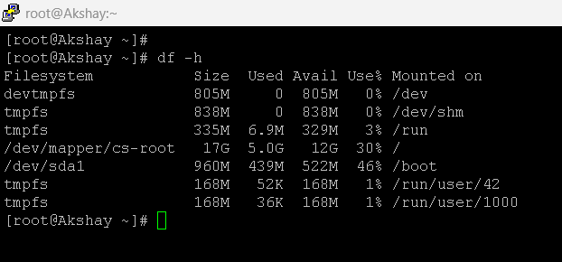

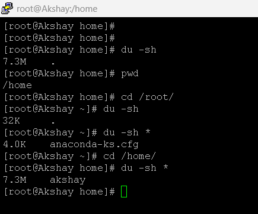

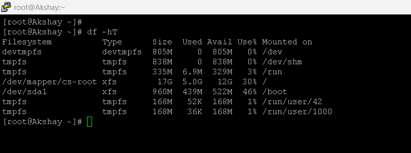

# Logging System Metrics

Create log directory:

            sudo mkdir -p /var/log/system-monitor

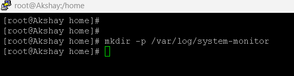

Create logging script:
            sudo vi /usr/local/bin/system_monitor.sh

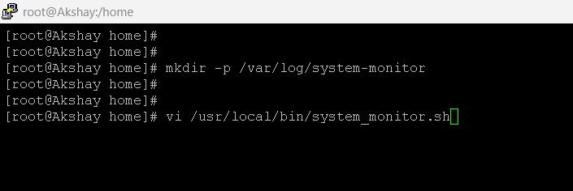

open file and past below script 

            #!/bin/bash
            echo "Date: $(date)" >> /var/log/system-monitor/metrics.log
            uptime >> /var/log/system-monitor/metrics.log
            free -h >> /var/log/system-monitor/metrics.log
            df -h >> /var/log/system-monitor/metrics.log
            ps -eo pid,comm,%cpu,%mem --sort=-%cpu | head -10 >> /var/log/system-monitor/metrics.log
            echo "----------------------------" >> /var/log/system-monitor/metrics.log

After copy past press:--     :!wq

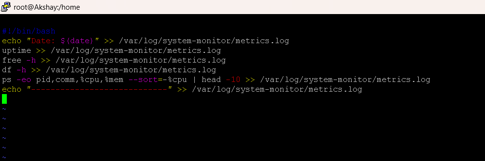

Make executable:

            sudo chmod +x /usr/local/bin/system_monitor.sh

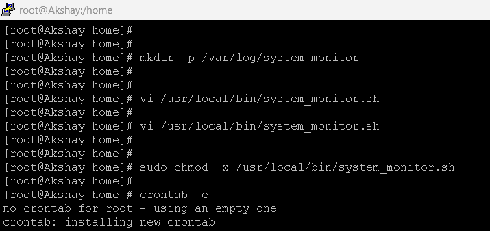

Add cron job (every 10 minutes):

            crontab -e

            */10 * * * * /usr/local/bin/system_monitor.sh

✔ Logs stored in /var/log/system-monitor/metrics.log

# Task 2: User Management and Access Control
Created secure user accounts with isolated workspaces and enforced password policies.

Users Created:
            sudo useradd sarah
            sudo useradd mike

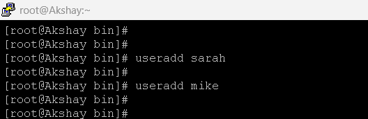

Set passwords:
            sudo passwd sarah
            sudo passwd mike

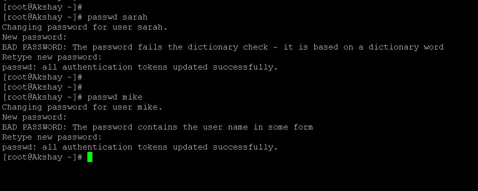

Create Isolated Workspace Directories:

Sarah: /home/sarah/workspace
            sudo mkdir /home/sarah/workspace

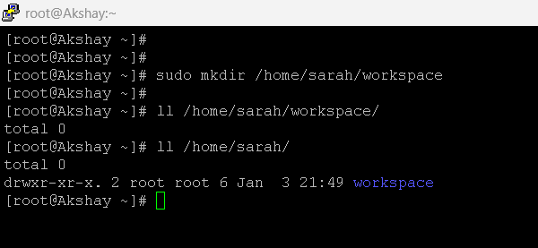

Mike: /home/mike/workspace
            sudo mkdir /home/mike/workspace

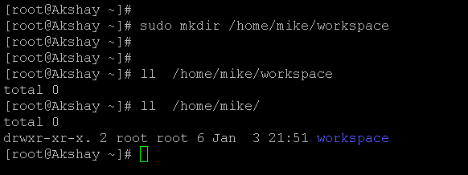

Set ownership:
            sudo chown -R sarah:sarah /home/sarah
            sudo chown -R mike:mike /home/mike

Set permissions:

            sudo chmod 700 /home/sarah
            sudo chmod 700 /home/mike

✔ Only owner can access their directory⚔️⚔️⚔️

# Password Expiration Policy
        Password expiration was enforced using:
        sudo chage -l sarah
        sudo chage -M 30 sarah

       

        sudo chage -l mike
        sudo chage -M 30 mike

 
        
        To verify:
        sudo chage -l sarah
        sudo chage -l mike

        Passwords expire every 30 days.

# Enforce Password Policy
Edit:-
            sudo vi /etc/login.defs

    Set:-- 
            PASS_MAX_DAYS 90
            PASS_MIN_DAYS 7
            PASS_WARN_AGE 7

Install password quality module:
            sudo dnf install libpwquality -y

Edit:-- 
            sudo vi /etc/security/pwquality.conf

Example policy:--

            minlen = 12
            dcredit = -1
            ucredit = -1
            ocredit = -1
            lcredit = -1

✔ Password expiration

✔ Complexity enforced

# Backup Configuration for Web Servers
Objective:-- 
    Automated backups for Apache & Nginx, scheduled weekly, proper naming, verification, logs.

1. Create Backup Directory

            sudo mkdir -p /backup/web

2. Backup Script
            sudo vi /usr/local/bin/web_backup.sh
============
            #!/bin/bash

            DATE=$(date +%F)
            BACKUP_DIR="/backup/web"
            LOG_FILE="/var/log/web_backup.log"

            tar -czf $BACKUP_DIR/apache_backup_$DATE.tar.gz /etc/httpd /var/www/html 2>>$LOG_FILE
            tar -czf $BACKUP_DIR/nginx_backup_$DATE.tar.gz /etc/nginx /usr/share/nginx/html 2>>$LOG_FILE

            echo "Backup completed on $(date)" >> $LOG_FILE

